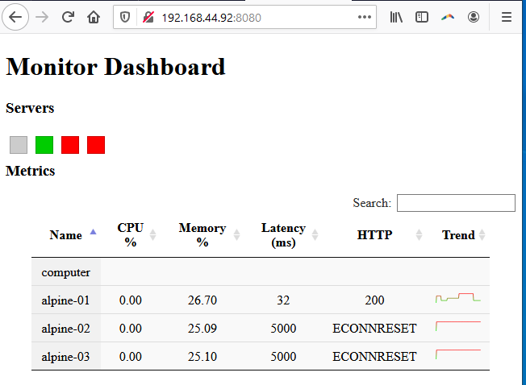

# Monitoring

In this workshop, we'll cover the basic principles related to establishing a monitoring infrastructure.  



### Monitoring Architecture


The monitoring infrastructure has several components.

##### Dashboard

The dashboard visualization is located in `dashboard/www/`. The webpage uses vue.js to implement databinding between the server metrics and the html components (i.e. Model-View-ViewModel).

##### Events with socket.io (monitor service => dashboard)

Another technology that you have not been previously exposed to is [socket.io](http://socket.io/). The code in `dashboard/metrics/index.js` creates a websocket that publishes events for the dashboard to consume and display.

##### Publish-subscribe with redis (agents => monitor service)

The agent and dashboard communicate through a [publish-subscribe message paradigm](https://redis.io/topics/pubsub) provided by the redis `PUBLISH` and `SUBSCRIBE` commands. The redis server is hosted on the monitor server.

Here, you can see the monitoring agent *publishing* metrics to a channel (corresponding to the server name), every 1 second (`agent/index.js`).

```js
    // Push update ever 1 second
    setInterval(async function()
    {
        let payload = {
            memoryLoad: agent.memoryLoad(),
            cpu: await agent.cpu()
        };
        let msg = JSON.stringify(payload);
        await client.publish(name, msg);
        console.log(`${name} ${msg}`);
    }, 1000);
```

Likewise, you can see the monitoring service *subscribing* to updates from a channel (`dashboard/metrics/index.js`).

```js
// When an agent has published information to a channel, we will receive notification here.
	client.on("message", function (channel, message) 
	{
		console.log(`Received message from agent: ${channel}`)
		for( var server of servers )
		{
			// Update our current snapshot for a server's metrics.
			if( server.name == channel)
			{
				let payload = JSON.parse(message);
				server.memoryLoad = payload.memoryLoad;
				server.cpu = payload.cpu;
				updateHealth(server);
			}
		}
	});
```

##### Servers being monitored

You have three servers running, which are accessible through a port forward on your localhost (ports 9001, 9002, and 9003). Furthermore, each server provides the following services accessible under these endpoints: `/`, `/work`, and `/stackless`---each endpoint provides different levels of workload for the server, with `/work` being the most computationally expensive.

##### Monitoring agent

The monitoring agent is in `agent/index.js`.

You will need to complete the code for the monitoring agent, and then install it on the servers being monitored.

```js
// TASK 1: Calculate metrics.
class Agent
{
    memoryLoad()
    {
       return 0;
    }
    async cpu()
    {
       return 0;
    }
}
```

The package, [`systeminformation`](https://www.npmjs.com/package/systeminformation), has an extensive collection of utils for obtaining and measuring system metrics.

## Workshop

### Before you start

Clone this repository.

Pull the following bakerx images.

```bash
# Updated to allow redis access from remote hosts
bakerx pull CSC-DevOps/Images#Spring2020 queues
bakerx pull CSC-DevOps/Images#Spring2020 alpine-node
```

Bring up the infrastructure.

```bash
cd Monitoring/servers
npm install
node index up
```

Inspect the console output for any errors, then confirm VMs have started in VirtualBox.


Open a terminal dedicated to the monitor instance and ssh into machine, `bakerx ssh monitor`.
Change into dashboard directory (which will be mounted at `/bakerx`), install packages, and start dashboard service.

```bash
cd /bakerx
npm install
node bin/www
```

Visit the monitoring dashboard at http://192.168.44.92:8080/. Confirm you can see the dashboard running.

## Monitoring infrastructure

### Task 1: Add memory/cpu metrics.

Modify `function memoryLoad()` to calculate the amount of memory currently used by the system as a percentage.
Modify `function cpuAverage()` to calculate the amount of load the cpu is under as a percentage (see [`systeminformation.currentLoad`](https://www.npmjs.com/package/systeminformation#8-current-load-processes--services)).


Once you've completed your code updates, you can test it out by registering your computer as client. Simply run the agent as follows:

```
cd agent/
node index.js computer
```

You should be able to verify your metrics being displayed in the dashboard. Recall, you should have `node bin/www` running inside the monitor VM.

##### Install agent on servers.

You can deploy this agent to run on your servers by using the `push` command provided in the driver:

```bash
cd servers/
node index.js push
```

You should see memory/cpu information being displayed in the dashboard for all the servers, including your computer.

### Task 2: Latency and HTTP status codes.

Collecting metrics related to availability and efficiency of services often requires an external third-party. Here, the monitor service will be extended to collect data related to latency and service status.

Extend the code inside `dashboard/metrics/index.js` to collect the latency and status code of the http response (`res.statusCode`).

```js
	// LATENCY CHECK
	var latency = setInterval( function () 
	{
		...
				got(server.url, {timeout: 5000, throwHttpErrors: false}).then(function(res)
		...
```

Restart the monitoring service, you should see the dashboard display latency information.

### Task 3: Calculate and display server health.

You want to make an overall assessment of a server's health. We will be using our four metrics to calculate an overall health score (4 being good healthy and 0 being unhealthy).

Update the code inside `dashboard/metrics/index.js#updateHealth(server)` to 
create a metric that calculates an overall score from memoryLoad, cpu, latency, and statusCode.

You should see the dashboard reflect the health of your servers in the server status field, as well as sparkline update to indicate the changes in score's trend per server.

### Task 4: Load services.

From your host computer, you should be able to visit `http://localhost:9001/work` in your browser, or make a curl request `curl http://localhost:9001/work` and see corresponding changes in the metrics from your dashboard.

Notice the impact of the workload based on hitting different endpoints:

* http://localhost:9001/
* http://localhost:9001/stackless
* http://localhost:9001/work


##### Can we create a even bigger load?

Siege is a tool for performing load testing of a site.

```
vagrant@ubuntu-bionic:/bakerx/metrics$ siege -b -t30s http://172.30.164.193:9001/
** SIEGE 4.0.4
** Preparing 25 concurrent users for battle.
The server is now under siege...
Lifting the server siege...
Transactions:                  34088 hits
Availability:                 100.00 %
Elapsed time:                  29.10 secs
Data transferred:               0.39 MB
Response time:                  0.02 secs
Transaction rate:            1171.41 trans/sec
Throughput:                     0.01 MB/sec
Concurrency:                   24.63
Successful transactions:       34088
Failed transactions:               0
Longest transaction:            0.53
Shortest transaction:           0.00
```

##### Installing siege

Mac: `brew install siege`  
Linux: `apt-get install siege`  
Windows: Install inside the monitor server (`bakerx ssh monitor`). Note: You should use the ip of your host computer (see dashboard/metrics/ip.txt) instead of localhost to create the desired effect.

Experiment with loading the server by hitting different endpoints. Can you cause the service to timeout?
```
siege -b -t30s http://localhost:9001/
siege -b -t30s http://localhost:9001/stackless
siege -b -t30s http://localhost:9001/work
```

### Task 5: New metric.

Add a new metric in the agent and display it in the dashboard. This should help you better understand the flow of the monitoring collection, broadcast mechanics, and display of metrics.
